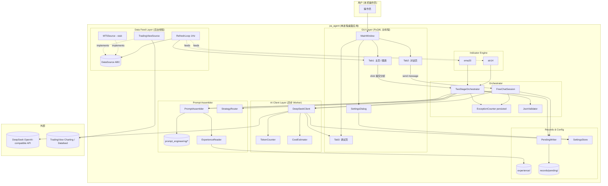
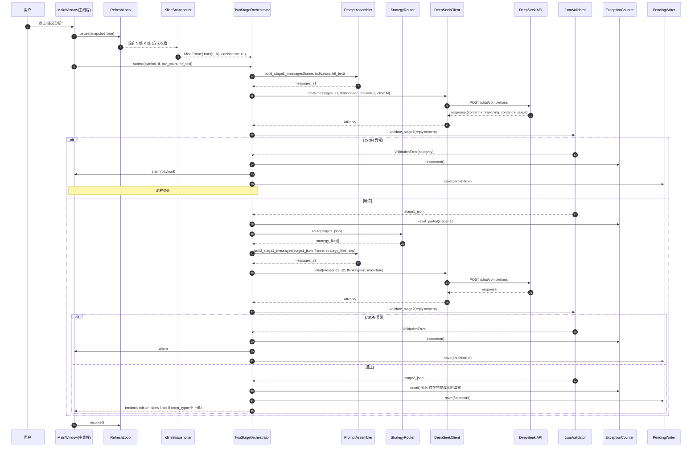
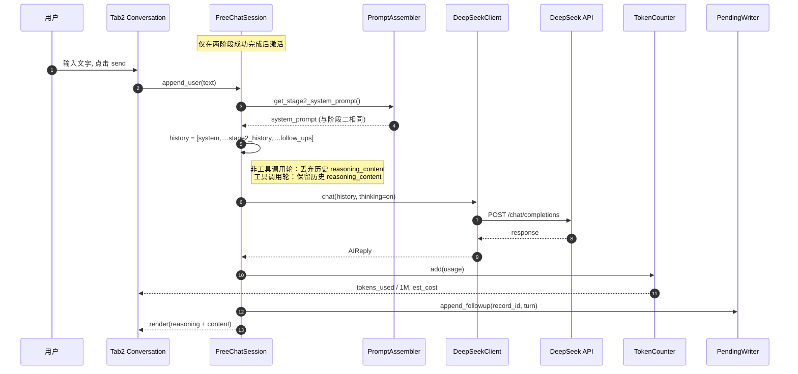

# 设计文档：AI K线分析程序（ai-kline-analyzer）

## 0. 文档说明

本文档遵循"先设计后需求"的工作流，包含 **A. 高层设计（High-Level Design）** 与 **B. 低层设计（Low-Level Design）** 两大部分。本程序是一个**纯辅助决策工具**，不执行任何交易动作。

设计严格依据 `prompt_engineering/使用说明.txt` v1.0（2026-05-18）以及用户在本轮对话中给出的最终澄清条款。当两者冲突时，以**用户澄清条款为准**（详见第 2.2 节"对使用说明的覆盖项"）。

代码标识符使用英文，文档使用中文。

---

# A. 高层设计（High-Level Design）

## 1. 产品定位回顾

| 维度 | 取值 |
| --- | --- |
| 程序性质 | 辅助决策工具（Decision-Aid Tool） |
| 是否触达交易接口 | **否**。不下单、不撤单、不持仓 |
| 触发方式 | 用户手动点击"提交分析" |
| 风控层 | 仅 JSON 异常处理 + 连续异常熔断；不做硬编码价格／方向校验 |
| 输出 | 结构化决策 JSON + 完整记录文件 + GUI 可视化 |
| 归类 | 用户手动从 `records/pending/` 搬移到 `experience/<cycle>/{success_cases\|failure_cases}/` |

## 2. 设计依据

### 2.1 文件清单（与使用说明一致）

- 4 个**常驻**提示词文件（每次分析必加载）
- 13 个**条件加载**策略 / 形态文件（由阶段一输出 + 路由器决定）
- 1 个使用说明（仅供人类阅读，不进入提示词）

合计 18 个文件，全部位于 `D:\cl\PA_Agent\prompt_engineering\`，由程序在运行期以只读方式加载。

### 2.2 对使用说明的覆盖项（用户澄清，最高优先级）

| 编号 | 澄清要点 | 覆盖的原条款 |
| --- | --- | --- |
| C1 | K 线数据源仅启用 TradingView，但保留 `DataSource` 抽象，使 MT5 可以平滑接入 | 使用说明未明确数据源 |
| C2 | 默认模型 = DeepSeek V4 Pro；thinking 开启；`reasoning_effort="max"`；1M 上下文 | 使用说明 §12.4 32K 起步 |
| C3 | GUI 必须有可编辑的 AI Provider 设置面板，并将配置持久化 | 使用说明未明确 |
| C4 | 高时间框架（HTF）描述由用户**手动**输入，不自动抓取 | 使用说明 §6 阶段一 User Prompt |
| C5 | K 线刷新节奏 = 每 1 秒拉一次最新快照 | 使用说明 §5 "持续获取" |
| C6 | 提交分析的快照**必须**包含当前未收盘 K 线（作为序号 #1） | 使用说明 §8 仅说"最新 K 线" |
| C7 | 用户可在 GUI 中切换品种 / 周期，需明确订阅、取消、序号重置语义 | 使用说明未明确 |
| C8 | 图表 K 线根数与提交给 AI 的 K 线根数 **同源**，由用户输入决定（默认 200） | 覆盖使用说明 §12.1 "30-50 根" 与 §12.4 "保留最近 20 根" |
| C9 | 序号 1..N，#1 = 最新（含未收盘），图表必须可视化标注序号 | 使用说明 §8 仅说数据带序号 |
| C10 | "连续 JSON 异常"是**跨多次提交**的累计计数器，仅在一次完整成功后清零 | 使用说明 §7e 含义不清 |
| C11 | 当 `order_type = "不下单"` 时，三个价格字段必须为 `null`（不允许 0），图表也不画线 | 使用说明 §9 允许 "0 或 null" |
| C12 | 经验库 "recent" 的排序键 = 文件名内嵌的时间戳，倒序；取前 5 | 使用说明 §12.5 "交易发生日期" |
| C13 | GUI 至少 3 个 Tab：主页 / 对话页（含后续自由聊天 + token & 费用计） / 调试页 | 使用说明 §5 仅描述 3 个区域 |
| C14 | 记录文件路径与字段集合扩展（含本地时间戳、reasoning_content、provider 配置快照、后续聊天） | 使用说明 §10.1 字段较少 |
| C15 | 经验库根目录 = `D:\cl\PA_Agent\experience\<cycle>\{success_cases\|failure_cases}\`，程序只读 | 使用说明 §10.2 |

## 3. 组件总览（C4 Container 视角，Mermaid）



## 4. 端到端：点击"提交分析"序列



## 5. 后续自由聊天序列（Tab 2）



## 6. 线程模型与响应性

| 线程 | 职责 | 关键约束 |
| --- | --- | --- |
| **UI 线程**（Qt main） | 渲染图表、处理用户输入、刷新 token / cost 指示器 | 不允许阻塞 I/O；所有耗时操作走 `QThread` / `QtConcurrent` |
| **DataFeed 线程**（QThread） | 1Hz 拉取最新 K 线快照，更新内存缓冲 `KlineBuffer` | 只写 `KlineBuffer`；通过 `pyqtSignal` 把帧推给 UI |
| **AI Worker 线程**（QThread + 取消令牌） | 调用 DeepSeek API、做 JSON 校验、串两阶段、写 record 文件 | 一次只允许一个 worker；新提交需先取消旧 worker |
| **Render 子任务**（UI 线程内的 30Hz 重绘节流） | 把 `KlineBuffer` 的最新切片渲染到 ChartWidget | 用 `QTimer` 调度，避免和 1Hz 数据线程抢资源 |

抗阻塞机制：
- 所有 API 调用使用阻塞 SDK 但运行在 worker 线程；UI 线程通过信号槽接收结果，禁止 `app.processEvents()` 滥用。
- DataFeed 线程在网络抖动时本轮跳过，不抛异常到 UI；连续 5 秒拉不到数据则在状态栏显示 "数据延迟"。
- 用户切换品种 / 周期会**取消**当前 AI worker（见 §B.10 取消语义）。

## 7. 数据流与目录布局

```
D:\cl\PA_Agent\
├── prompt_engineering\          ← 17 个提示词文件 + 使用说明（只读）
├── pa_agent\                    ← 程序源码（见 §B.1）
├── records\
│   └── pending\                 ← 每次分析自动写入
│       ├── 2026-05-18_14-00-13_XAUUSD_1h.json
│       └── 2026-05-18_14-00-13_XAUUSD_1h.followups.jsonl
├── experience\                  ← 用户手动维护
│   ├── micro_channel\
│   │   ├── success_cases\
│   │   └── failure_cases\
│   ├── tight_channel\
│   ├── normal_channel\
│   ├── broad_channel\
│   ├── spike\
│   ├── trading_range\
│   ├── trending_tr\
│   ├── extreme_tr\
│   └── unknown\
├── config\
│   ├── settings.json            ← provider 配置（API key 加密）
│   └── exception_state.json     ← 持久化连续异常计数
└── logs\
    └── pa_agent.log             ← 旋转日志，永不写明文 API key
```

## 8. 技术栈与依赖

| 类别 | 选型 | 理由 |
| --- | --- | --- |
| GUI | **PyQt6** | 跨线程信号槽完善、`QChartView` / `pyqtgraph` 可绘高频图表、社区成熟 |
| 图表 | `pyqtgraph` 自绘蜡烛 + 序号文本项 | 比 mplfinance 更适合 1Hz 实时刷新；无浏览器依赖 |
| K 线源 | TradingView：使用 `tvDatafeed`（开源非官方包）。MT5 stub 留给 `MetaTrader5` 包 | 用户需求 C1 |
| 指标 | 自实现 EMA20、ATR14（NumPy） | 避免引入 TA-Lib C 依赖 |
| AI SDK | **`openai>=1.40` Python SDK**（OpenAI-compatible）| DeepSeek 官方推荐 |
| Token 估算 | `tiktoken`（cl100k_base 近似） | DeepSeek 与 OpenAI tokenizer 接近，足以做预算估计；准确值以服务端 `usage` 为准 |
| 配置 | `pydantic` v2 + JSON 文件 | 类型校验 + 易序列化 |
| API key 保护 | Windows DPAPI（`pywin32` 或 `cryptography.fernet` + 机器绑定盐） | 静态加密，避免明文落盘 |
| 日志 | `logging` + `RotatingFileHandler` | 自动屏蔽 API key（mask 至最后 4 位） |
| JSON Schema | `jsonschema` 库 | 用于阶段一 / 阶段二的字段校验 |
| 测试 | `pytest` + `hypothesis`（PBT） | 见 §B.13 性质表 |

依赖清单（`requirements.txt` 草案）：

```text
PyQt6>=6.6
pyqtgraph>=0.13
numpy>=1.26
pandas>=2.2
openai>=1.40
tiktoken>=0.7
jsonschema>=4.22
pydantic>=2.7
tvdatafeed @ git+https://github.com/<fork>/tvdatafeed
cryptography>=42
pywin32; sys_platform == 'win32'
pytest>=8
hypothesis>=6
```

> MT5 包将在 stub 实现完毕后再行加入；当前不强依赖。


---

# B. 低层设计（Low-Level Design）

## B.1 模块划分与文件布局

所有源码位于 `D:\cl\PA_Agent\pa_agent\`：

```
pa_agent/
├── __init__.py
├── main.py                       # 入口：启动 QApplication、装配依赖
├── app_context.py                # 全局上下文 (Settings, Buses, Logger)
├── gui/
│   ├── __init__.py
│   ├── main_window.py            # 三 Tab 容器
│   ├── chart_widget.py           # K 线图 + 序号 + 入场/SL/TP 叠加
│   ├── decision_panel.py         # Tab1 右侧的决策摘要面板
│   ├── conversation_widget.py    # Tab2：消息流 + 输入框 + token/费用条
│   ├── debug_widget.py           # Tab3：构造 prompt / 原始响应 / 重试 / JSON 错误
│   ├── settings_dialog.py        # AI Provider 设置面板
│   └── widgets/
│       ├── candle_item.py        # 自绘 candlestick 项 (pyqtgraph)
│       ├── seq_label_item.py     # 序号文字项
│       └── overlay_lines.py      # 入场 / SL / TP 横线
├── data/
│   ├── __init__.py
│   ├── base.py                   # DataSource ABC + KlineBar / KlineFrame
│   ├── kline_buffer.py           # 线程安全的环形缓冲
│   ├── tradingview.py            # 启用的实现
│   ├── mt5.py                    # 预留 stub，raise NotImplementedError
│   └── refresh_loop.py           # 1Hz QThread 拉取
├── indicators/
│   ├── __init__.py
│   ├── ema.py
│   └── atr.py
├── ai/
│   ├── __init__.py
│   ├── deepseek_client.py        # OpenAI-compatible 客户端封装
│   ├── prompt_assembler.py       # 拼装 system / user prompts
│   ├── router.py                 # 诊断→策略文件路由
│   ├── json_validator.py         # 阶段一 / 阶段二 schema 校验
│   ├── token_counter.py          # tiktoken + 服务端 usage 校准
│   ├── cost_estimator.py         # 价格表 + 估算
│   └── prompts/
│       └── schemas.py            # 内置 JSON Schema 常量
├── orchestrator/
│   ├── __init__.py
│   ├── two_stage.py              # TwoStageOrchestrator
│   ├── free_chat.py              # FreeChatSession
│   ├── exception_counter.py      # 跨进程持久化的连续异常计数
│   └── snapshot.py               # 拍照：含未收盘 #1 的 KlineFrame
├── records/
│   ├── __init__.py
│   ├── pending_writer.py
│   ├── experience_reader.py
│   └── schema.py                 # AnalysisRecord 数据类
├── config/
│   ├── __init__.py
│   ├── settings.py               # pydantic Settings model + 加密读写
│   └── paths.py                  # 一处声明所有目录常量
├── security/
│   ├── __init__.py
│   └── secret_store.py           # API key 加密 / 屏蔽
└── util/
    ├── __init__.py
    ├── timefmt.py                # 时间戳格式化（仅本机时区）
    └── threading.py              # CancelToken / signal helpers
```

## B.2 关键类型与接口（Python 类型签名）

### B.2.1 数据层

```python
# pa_agent/data/base.py
from abc import ABC, abstractmethod
from dataclasses import dataclass
from typing import Iterable, Optional

@dataclass(frozen=True)
class KlineBar:
    seq: int                 # 1..N，1 = 最新（含未收盘）
    ts_open: int             # epoch ms（本机时区无关，UTC ms）
    open: float
    high: float
    low: float
    close: float
    volume: float
    closed: bool             # False 表示未收盘的 forming bar

@dataclass(frozen=True)
class KlineFrame:
    symbol: str
    timeframe: str           # "1m"/"5m"/"15m"/"1h"/...
    bars: tuple[KlineBar, ...]   # len == N，bars[0].seq == 1
    snapshot_ts_local_ms: int    # 拍照时刻（本机时间）
    indicators: "IndicatorBundle"

@dataclass(frozen=True)
class IndicatorBundle:
    ema20: tuple[float, ...]     # 与 bars 同序，对齐到 seq
    atr14: tuple[float, ...]

class DataSource(ABC):
    @abstractmethod
    def connect(self) -> None: ...
    @abstractmethod
    def disconnect(self) -> None: ...
    @abstractmethod
    def list_symbols(self) -> list[str]: ...
    @abstractmethod
    def supported_timeframes(self) -> list[str]: ...
    @abstractmethod
    def subscribe(self, symbol: str, timeframe: str) -> None: ...
    @abstractmethod
    def unsubscribe(self) -> None: ...
    @abstractmethod
    def latest_snapshot(self, n: int) -> KlineFrame:
        """拉取最近 n 根 K 线，包含当前未收盘的那根（seq=1）。"""
```

### B.2.2 指标

```python
# pa_agent/indicators/ema.py
def ema(values: list[float], period: int) -> list[float]: ...

# pa_agent/indicators/atr.py
def atr(highs: list[float], lows: list[float], closes: list[float], period: int) -> list[float]: ...
```

两者均按"前 period-1 个位置返回 NaN"的标准实现，并保证：对未收盘 bar 计算 EMA/ATR 时，**用未收盘 bar 的当前 close / high / low 作为输入**——AI 看到的是该时刻的真实指标值。

### B.2.3 AI 客户端

```python
# pa_agent/ai/deepseek_client.py
from typing import Iterable, Optional
from dataclasses import dataclass

@dataclass(frozen=True)
class AIUsage:
    prompt_tokens: int
    completion_tokens: int
    cached_prompt_tokens: int  # 命中缓存的 input token 数
    total_tokens: int

@dataclass(frozen=True)
class AIReply:
    content: str
    reasoning_content: Optional[str]
    raw: dict                   # API 完整 JSON，给调试 Tab 使用
    usage: AIUsage
    request_id: Optional[str]
    latency_ms: int

class DeepSeekClient:
    def __init__(self, settings: "AIProviderSettings", logger): ...

    def chat(
        self,
        messages: list[dict],          # OpenAI 格式
        *,
        thinking: bool = True,
        reasoning_effort: str = "max",
        context_window: int = 1_000_000,
        cancel_token: "CancelToken" = None,
        timeout_s: float = 600,
    ) -> AIReply: ...
```

调用要点：
- 始终 `extra_body={"thinking": {"type": "enabled" if thinking else "disabled"}}`，并通过 `extra_body["reasoning_effort"] = reasoning_effort` 传入，**不传** `temperature`/`top_p`/`presence_penalty`/`frequency_penalty`（thinking 模式不支持）。
- `context_window` 只用于本地预算检查与 UI 显示；DeepSeek 的 1M 窗口由模型本身保证。
- `cancel_token` 在用户切换品种 / 周期或关闭窗口时被置位；客户端检查并尝试 `client.close()` 关闭流。
- 请求与响应都通过 `logger.debug` 写入 `logs/pa_agent.log`，但 API key 已被 `security.secret_store.mask_secret` 替换为 `sk-****abcd`。

### B.2.4 Prompt Assembler

```python
# pa_agent/ai/prompt_assembler.py
from typing import Optional

class PromptAssembler:
    def __init__(self, prompt_dir: str, experience_reader: "ExperienceReader"): ...

    # 阶段一
    def build_stage1(
        self,
        frame: KlineFrame,
        htf_text: str,
    ) -> list[dict]: ...

    # 阶段二
    def build_stage2(
        self,
        frame: KlineFrame,
        stage1_json: dict,
        strategy_files: list[str],
        experience_entries: list["ExperienceEntry"],
    ) -> list[dict]: ...

    # 后续聊天复用阶段二 system prompt
    def stage2_system_prompt_only(
        self,
        stage1_json: dict,
        strategy_files: list[str],
        experience_entries: list["ExperienceEntry"],
    ) -> str: ...
```

### B.2.5 Orchestrator

```python
# pa_agent/orchestrator/two_stage.py
class TwoStageOrchestrator:
    def __init__(self, client, assembler, router, validator,
                 exc_counter, pending_writer, exp_reader,
                 cost_estimator): ...

    def submit(
        self,
        frame: KlineFrame,
        htf_text: str,
        cancel_token: "CancelToken",
        on_event: "Callable[[OrchestratorEvent], None]",
    ) -> "AnalysisRecord": ...

# pa_agent/orchestrator/free_chat.py
class FreeChatSession:
    def __init__(self, base_record: "AnalysisRecord",
                 client, assembler, pending_writer): ...

    def send(self, user_text: str,
             cancel_token: "CancelToken") -> AIReply: ...
```

`OrchestratorEvent` 是面向 GUI 的事件枚举：`Stage1Started / Stage1Done / Stage1Failed / Stage2Started / Stage2Done / Stage2Failed / RecordSaved`。

### B.2.6 Records

```python
# pa_agent/records/schema.py
from pydantic import BaseModel
from typing import Optional, Any

class RecordMeta(BaseModel):
    timestamp_local_iso: str       # 本机时间（点击时刻），用于文件名
    timestamp_local_ms: int
    symbol: str
    timeframe: str
    bar_count: int
    ai_provider: dict              # 已脱敏的 provider 配置快照

class AnalysisRecord(BaseModel):
    meta: RecordMeta
    kline_data: list[dict]         # 与提交给 AI 的数据完全一致
    htf_text: str
    stage1_messages: list[dict]
    stage1_response: Optional[dict]    # raw response（含 reasoning_content）
    stage1_diagnosis: Optional[dict]
    stage2_messages: list[dict]
    stage2_response: Optional[dict]
    stage2_decision: Optional[dict]
    strategy_files_used: list[str]
    experience_loaded: list[dict]
    exception: Optional[dict]      # 若中途异常，记录类别 + 调试信息
    usage_total: dict              # 累计 usage，用于审计
```

后续聊天落盘到旁路 JSONL 文件 `<basename>.followups.jsonl`，每行：

```json
{"turn": 3, "ts_ms": 1716014413000, "user": "...", "ai_content": "...", "ai_reasoning": "...", "usage": {...}}
```

### B.2.7 配置

```python
# pa_agent/config/settings.py
from pydantic import BaseModel, Field

class AIProviderSettings(BaseModel):
    model: str = "deepseek-v4-pro"
    base_url: str = "https://api.deepseek.com"
    api_key_encrypted: str = ""           # DPAPI/Fernet 密文
    thinking: bool = True
    reasoning_effort: str = "max"          # "low"|"medium"|"high"|"max"
    context_window: int = 1_000_000
    pricing: "PricingTable"                # 见 §B.9

class GeneralSettings(BaseModel):
    default_bar_count: int = 200
    refresh_interval_ms: int = 1000
    cost_warning_threshold_pct: int = 80   # 1M 预算告警阈值
    last_symbol: str = "XAUUSD"
    last_timeframe: str = "1h"
    last_htf_text: str = ""

class Settings(BaseModel):
    provider: AIProviderSettings
    general: GeneralSettings
```

## B.3 提示词拼装伪代码

```pascal
PROCEDURE build_stage1(frame, htf_text)
  INPUT:
    frame: KlineFrame              // bars[1..N], 含未收盘 bar (seq=1)
    htf_text: String               // 用户在 GUI 输入的 HTF 描述
  OUTPUT:
    messages: list of OpenAI chat-message

  PRECONDITION:
    frame.bars[0].seq == 1 AND frame.bars[0].closed == false
    bars 长度 == N == general.default_bar_count (用户输入)
    indicators 已对齐填好

  SEQUENCE
    sys_parts ← []
    APPEND sys_parts WITH read_file("提示词大纲_人设与思维方式.txt")
    APPEND sys_parts WITH read_file("市场诊断框架.txt")
    APPEND sys_parts WITH read_file("文件16-K线信号识别.txt")
    APPEND sys_parts WITH read_file_optional("阶段一_输出格式提醒.md")  // 内置，强制 JSON

    system_prompt ← JOIN sys_parts WITH "\n\n---\n\n"

    user_parts ← []
    APPEND user_parts WITH "## 当前品种与周期"
    APPEND user_parts WITH f"symbol={frame.symbol}, timeframe={frame.timeframe}, N={len(frame.bars)}"
    APPEND user_parts WITH "## K线数据 (序号1=最新, 包含当前未收盘bar)"
    APPEND user_parts WITH render_kline_table(frame.bars, frame.indicators)
    APPEND user_parts WITH "## EMA20 / ATR14"
    APPEND user_parts WITH render_indicator_table(frame.bars, frame.indicators)
    APPEND user_parts WITH "## 高时间框架背景 (用户提供)"
    APPEND user_parts WITH htf_text
    APPEND user_parts WITH "## 输出要求: 严格按JSON Schema返回, 不要任何额外文本"

    user_prompt ← JOIN user_parts WITH "\n\n"

    messages ← [
      {role: "system", content: system_prompt},
      {role: "user",   content: user_prompt}
    ]

    POSTCONDITION:
      messages 是合法 OpenAI 消息列表
      第一条消息 role == "system"
      第二条消息 role == "user"
      system_prompt 的拼接顺序完全等同于使用说明 §6 阶段一

    RETURN messages
  END SEQUENCE
END PROCEDURE


PROCEDURE build_stage2(frame, stage1_json, strategy_files, experience_entries)
  INPUT:
    frame, stage1_json, strategy_files, experience_entries
  OUTPUT:
    messages

  PRECONDITION:
    stage1_json 已通过 validator，cycle_position/direction 合法
    strategy_files 是 router 返回的去重列表
    experience_entries 长度 ≤ 5, 按文件名时间戳倒序

  SEQUENCE
    sys_parts ← []
    APPEND sys_parts WITH read_file("提示词大纲_人设与思维方式.txt")

    FOR EACH f IN strategy_files DO
      APPEND sys_parts WITH read_file(f)
    END FOR

    APPEND sys_parts WITH read_file("文件17-止损和止盈与仓位管理.txt")

    IF experience_entries IS NOT EMPTY THEN
      APPEND sys_parts WITH "## 经验库（最近5条，倒序）"
      FOR EACH e IN experience_entries DO
        APPEND sys_parts WITH render_experience(e)
      END FOR
    END IF

    APPEND sys_parts WITH "## 决策输出格式（严格JSON）"
    APPEND sys_parts WITH stage2_output_contract_text()  // 内置，含 null-when-不下单 规则

    system_prompt ← JOIN sys_parts WITH "\n\n---\n\n"

    user_parts ← []
    APPEND user_parts WITH "## 阶段一诊断结果"
    APPEND user_parts WITH JSON.stringify(stage1_json, indent=2)
    APPEND user_parts WITH "## K线数据 (与阶段一相同, 序号1=最新)"
    APPEND user_parts WITH render_kline_table(frame.bars, frame.indicators)
    APPEND user_parts WITH "## 输出要求: 严格JSON，不下单时三个价格字段必须为null"

    user_prompt ← JOIN user_parts WITH "\n\n"

    messages ← [
      {role: "system", content: system_prompt},
      {role: "user",   content: user_prompt}
    ]

    POSTCONDITION:
      messages 合法
      strategy_files 全部已嵌入 system_prompt
      不下单约束已显式声明

    RETURN messages
  END SEQUENCE
END PROCEDURE
```

## B.4 路由器伪代码（与使用说明 §11 等价）

```pascal
ALGORITHM route_strategy_files(diagnosis)
  INPUT:
    diagnosis: dict    // 阶段一已校验通过的 JSON
  OUTPUT:
    files: list of String, 去重后保持稳定顺序

  PRECONDITION:
    diagnosis.cycle_position ∈ {spike, micro_channel, tight_channel,
        normal_channel, broad_channel, trending_tr, trading_range,
        extreme_tr, unknown}
    diagnosis.direction      ∈ {bullish, bearish, neutral}
    diagnosis.detected_patterns ⊆ {wedge, reversal_attempt, ...}

  POSTCONDITION:
    f(diagnosis) 是确定性函数（同输入 → 同输出，含顺序）
    不会包含使用说明清单外的文件名
    返回的 list 元素唯一（去重）

  BEGIN
    cp     ← diagnosis.cycle_position
    dir    ← diagnosis.direction
    pat    ← diagnosis.detected_patterns
    files  ← []

    IF cp ∈ {micro_channel, tight_channel, normal_channel, broad_channel} THEN
      IF dir = "bullish" THEN
        APPEND files: "上涨通道分析识别.txt", "上涨通道交易策略.txt"
      ELSE IF dir = "bearish" THEN
        APPEND files: "下跌通道分析识别.txt", "下跌通道交易策略.txt"
      ELSE
        log_warning("Channel state with neutral direction")
      END IF
      APPEND files: "文件13-窄通道与宽通道策略.txt"

    ELSE IF cp = "spike" THEN
      IF dir = "bullish" THEN
        APPEND files: "极速上涨分析识别.txt", "极速上涨交易策略.txt"
      ELSE IF dir = "bearish" THEN
        APPEND files: "极速下跌分析识别.txt", "极速下跌交易策略.txt"
      ELSE
        log_warning("Spike with neutral direction")
      END IF

    ELSE IF cp ∈ {trading_range, trending_tr} THEN
      APPEND files: "震荡区间分析识别.txt", "震荡区间交易策略.txt"

    ELSE IF cp ∈ {extreme_tr, unknown} THEN
      // 不加载策略文件
      pass
    END IF

    IF "wedge"             ∈ pat THEN APPEND files: "文件14-楔形形态分析交易.txt"
    IF "reversal_attempt"  ∈ pat THEN APPEND files: "文件15-二次入场机会.txt"

    files ← stable_dedupe(files)
    RETURN files
  END
END ALGORITHM
```

## B.5 K 线快照与序号分配（含未收盘 bar）

```pascal
ALGORITHM take_snapshot(buffer, n)
  INPUT:
    buffer: KlineBuffer (按时间倒序逻辑视图)
    n:      int = 用户配置的 bar_count, n ≥ 2
  OUTPUT:
    frame:  KlineFrame

  PRECONDITION:
    buffer 内已有 ≥ n 根 K 线 (含 1 根未收盘)
    最新一根 buffer.head 的 closed == false

  POSTCONDITION:
    frame.bars 长度 = n
    frame.bars[0].seq = 1 ∧ frame.bars[0].closed = false
    ∀ i ∈ [0, n-1) : frame.bars[i+1].seq = frame.bars[i].seq + 1
    ∀ i ∈ [0, n-1) : frame.bars[i].ts_open > frame.bars[i+1].ts_open
    {bar.seq | bar ∈ frame.bars} = {1, 2, ..., n}    // 序号是 1..n 的双射

  BEGIN
    raw  ← buffer.last_n_including_forming(n)  // 时间倒序
    bars ← []
    FOR i ← 0 TO n-1 DO
      r       ← raw[i]
      bar     ← KlineBar(seq = i+1, ts_open = r.ts, ...,
                          closed = (i ≠ 0))
      APPEND bars WITH bar
    END FOR

    indicators ← compute_indicators(bars)   // EMA20/ATR14 已对齐
    RETURN KlineFrame(symbol, timeframe, tuple(bars),
                      now_local_ms(), indicators)
  END
END ALGORITHM
```

实现要点：
- `KlineBuffer` 内部以"已收盘列表 + 未收盘 head"两段存储；每秒 `RefreshLoop` 调用 `update_forming(bar)` 覆盖 head；当数据源给出 head 已收盘信号时，head 落盘成已收盘 bar，新建空 head。
- `take_snapshot` 必须在原子锁内完成，防止取样过程中 head 翻转。
- 提交分析后，`RefreshLoop` 不停止；只是 `KlineFrame` 已是不可变深拷贝，后续刷新不会污染送给 AI 的快照。

## B.6 1Hz 刷新循环

```pascal
PROCEDURE refresh_loop()  // 在 DataFeed QThread 内
  INPUT: data_source (subscribed), buffer, signal_to_ui
  PRECONDITION: data_source.subscribe(symbol, tf) 已成功调用
  POSTCONDITION: 每个迭代后 buffer.head 是 ≤1 秒前的最新 bar；UI 通过 signal 接收新帧

  SEQUENCE
    next_tick ← now_ms()
    WHILE NOT cancel_token.is_set() DO
      TRY
        latest ← data_source.fetch_recent(N + 5)   // 多取一点防越界
        buffer.merge(latest)                       // 内部分流：已收盘/未收盘
        signal_to_ui.emit(buffer.snapshot_view())
      CATCH NetworkError e
        log_warning("data delay", e)
        signal_to_ui.emit_status("数据延迟")
      END TRY

      next_tick ← next_tick + general.refresh_interval_ms
      sleep_until(next_tick)
    END WHILE
END PROCEDURE
```

UI 端用一个 30Hz 的 `QTimer` 把 `snapshot_view` 渲染到 `ChartWidget`，避免 1Hz 数据线程把绘制压力压回主线程。

## B.7 JSON 校验规则

### B.7.1 阶段一 Schema（节选）

```json
{
  "$schema": "https://json-schema.org/draft/2020-12/schema",
  "type": "object",
  "required": ["cycle_position", "direction", "diagnosis_confidence",
               "market_phase", "detected_patterns", "key_signals",
               "htf_context", "entry_setup", "strategy_files_needed"],
  "properties": {
    "cycle_position": {"enum": ["spike", "micro_channel", "tight_channel",
        "normal_channel", "broad_channel", "trending_tr",
        "trading_range", "extreme_tr", "unknown"]},
    "alternative_cycle_position": {
      "type": ["string", "null"],
      "enum": [null, "spike", "micro_channel", "tight_channel",
               "normal_channel", "broad_channel", "trending_tr",
               "trading_range", "extreme_tr", "unknown"]
    },
    "direction": {"enum": ["bullish", "bearish", "neutral"]},
    "diagnosis_confidence": {"enum": ["high", "medium", "low"]},
    "spike_stage": {"enum": [null, "active", "ending", "transitioning"]},
    "market_phase": {"enum": ["stable", "transitioning"]},
    "transition_risk": {"enum": [null, "high", "medium", "low"]},
    "detected_patterns": {"type": "array", "items": {"type": "string"}},
    "key_signals": {"type": "array", "items": {"type": "string"}},
    "htf_context": {"type": "string"},
    "entry_setup": {"type": "string"},
    "strategy_files_needed": {"type": "array", "items": {"type": "string"}},
    "risk_warning": {"type": ["string", "null"]}
  },
  "allOf": [
    {
      "if": {"properties": {"cycle_position": {"const": "spike"}}},
      "then": {"required": ["spike_stage"]}
    },
    {
      "if": {"properties": {"cycle_position": {"const": "micro_channel"}}},
      "then": {"required": ["spike_stage"]}
    },
    {
      "if": {"properties": {"market_phase": {"const": "transitioning"}}},
      "then": {"required": ["transition_risk"]}
    }
  ]
}
```

### B.7.2 阶段二 Schema（节选 + 不下单约束）

```json
{
  "type": "object",
  "required": ["decision", "diagnosis_summary"],
  "properties": {
    "decision": {
      "type": "object",
      "required": ["order_direction", "order_type",
                   "entry_price", "take_profit_price", "stop_loss_price",
                   "reasoning", "confidence", "key_factors",
                   "watch_points", "risk_assessment", "invalidation_condition"],
      "properties": {
        "order_direction": {"enum": ["做多", "做空", null]},
        "order_type":      {"enum": ["限价单", "突破单", "市价单", "不下单"]},
        "entry_price":      {"type": ["number", "null"]},
        "take_profit_price":{"type": ["number", "null"]},
        "stop_loss_price":  {"type": ["number", "null"]},
        "reasoning":        {"type": "string", "minLength": 1},
        "confidence":       {"enum": ["high", "medium", "low"]},
        "key_factors":      {"type": "array", "items": {"type": "string"}, "minItems": 1},
        "watch_points":     {"type": "array", "items": {"type": "string"}},
        "risk_assessment":  {"type": "string"},
        "invalidation_condition": {"type": "string"}
      }
    },
    "diagnosis_summary": {
      "type": "object",
      "required": ["cycle_position", "direction", "key_signals"]
    }
  },
  "allOf": [
    {
      "if": {"properties": {"decision": {"properties": {"order_type": {"const": "不下单"}}}}},
      "then": {
        "properties": {
          "decision": {
            "properties": {
              "entry_price":       {"const": null},
              "take_profit_price": {"const": null},
              "stop_loss_price":   {"const": null},
              "order_direction":   {"const": null}
            }
          }
        }
      }
    },
    {
      "if": {"properties": {"decision": {"properties": {"order_type": {"enum": ["限价单","突破单","市价单"]}}}}},
      "then": {
        "properties": {
          "decision": {
            "properties": {
              "entry_price":       {"type": "number"},
              "take_profit_price": {"type": "number"},
              "stop_loss_price":   {"type": "number"},
              "order_direction":   {"enum": ["做多","做空"]}
            }
          }
        }
      }
    }
  ]
}
```

校验流水线（伪代码）：

```pascal
PROCEDURE validate(stage, raw_text)
  // 1. 提取 JSON
  text  ← strip_markdown_fences(raw_text)
  TRY
    obj ← JSON.parse(text)
  CATCH SyntaxError e
    RETURN ValidationError(category="a",
                           message=e.message,
                           position=e.pos,
                           raw_text=raw_text)

  // 2. Schema 校验
  errors ← jsonschema.iter_errors(obj, schema_for(stage))
  IF errors NOT EMPTY THEN
    missing ← collect_missing(errors)
    out_of_range ← collect_enum_or_range(errors)
    IF len(missing) > 0 THEN
      RETURN ValidationError(category="b", missing=missing, present=keys(obj), raw_text=raw_text)
    ELSE
      RETURN ValidationError(category="c",
                             field_value=out_of_range,
                             allowed=collect_allowed(errors),
                             raw_text=raw_text)
    END IF
  END IF

  // 3. 纯文本检测（兜底，正常路径不应该走到）
  IF NOT looks_like_json(raw_text) THEN
    RETURN ValidationError(category="d", raw_text=raw_text)
  END IF

  RETURN OK(obj)
END PROCEDURE
```

> 类别 e（连续异常）由 `ExceptionCounter` 在 orchestrator 层判定，不在单次 `validate` 中。

## B.8 连续异常计数器（持久化、跨提交累计）

```pascal
STRUCTURE ExceptionState
  consecutive_count: int
  last_error_category: char | null
  last_error_at_ms: int | null
  history: list of {ts_ms, stage, category, raw_excerpt}  // ≤ 50
END STRUCTURE

PROCEDURE on_validation_error(stage, err)
  state ← load_from_disk("config/exception_state.json")
  state.consecutive_count ← state.consecutive_count + 1
  state.last_error_category ← err.category
  state.last_error_at_ms ← now_ms()
  push_history(state, stage, err)
  save_to_disk(state)

  IF state.consecutive_count ≥ 1 THEN
    // 任何一次异常都立即报警，且若 ≥2 标注为 "连续异常"
    is_streak ← state.consecutive_count ≥ 2
    raise_alarm(stage, err, state, is_streak)
  END IF
END PROCEDURE

PROCEDURE on_round_trip_success()  // 仅在阶段一 + 阶段二都通过时调用
  state ← load_from_disk(...)
  state.consecutive_count ← 0
  // history 保留，便于复盘
  save_to_disk(state)
END PROCEDURE
```

不变量：
- `consecutive_count` 在失败连击中**单调非减**；只有 `on_round_trip_success` 才会重置为 0。
- 程序重启后 `consecutive_count` 不丢失（因为持久化到 `config/exception_state.json`）。

报警载荷形状（与使用说明 §7 框图一一对应）：

```python
@dataclass
class AlarmPayload:
    category: str                  # 'a'..'e'
    stage: str                     # '阶段一-诊断' | '阶段二-决策'
    timestamp_local_iso: str
    raw_text: str                  # 完整原文
    parse_position: Optional[str]  # 行号:列号
    missing_fields: list[str]
    invalid_fields: list[dict]     # [{field, value, allowed}]
    consecutive_count: int
    history_excerpt: list[dict]    # 最近 N 次错误摘要
```

GUI 在状态栏 + Tab3 + 弹窗三处同时呈现，并把"流程已终止，请检查后重试"作为最后一行。

## B.9 Token / 费用核算

```pascal
STRUCTURE PricingTable
  // 单位: ¥/M tokens
  input_cache_hit:  float       // V4 Pro: 0.1
  input_cache_miss: float       // V4 Pro: 12
  output:           float       // V4 Pro: 24
END STRUCTURE

PROCEDURE estimate_cost(usage: AIUsage, p: PricingTable) -> float
  hit  ← usage.cached_prompt_tokens
  miss ← usage.prompt_tokens - hit
  out  ← usage.completion_tokens
  RETURN (hit * p.input_cache_hit + miss * p.input_cache_miss + out * p.output) / 1_000_000
END PROCEDURE

CLASS SessionTokenLedger
  total_input: int = 0
  total_cached_input: int = 0
  total_output: int = 0
  total_cny: float = 0.0
  context_used: int = 0          // 用于 1M 进度条

  METHOD add(usage)
    total_input        += usage.prompt_tokens
    total_cached_input += usage.cached_prompt_tokens
    total_output       += usage.completion_tokens
    total_cny          += estimate_cost(usage, pricing)
    // 1M 上下文进度: input + output 累计
    context_used       += usage.prompt_tokens + usage.completion_tokens
  END METHOD

  METHOD warn_if_above(threshold_pct, ctx_window=1_000_000)
    IF context_used / ctx_window * 100 ≥ threshold_pct THEN
      emit_warning(...)
    END IF
  END METHOD
END CLASS
```

UI Tab2：
- "Tokens 已用 / 1M"：进度条 + 文本（如 `342,118 / 1,000,000  (34.2%)`）
- "估算费用：¥ X.XX"
- 阈值（默认 80%）触发黄色，95% 触发红色 + 弹窗

预估（发送前）：用 `tiktoken` 对系统 + 用户 prompt 编码取 `len(tokens)`；在 Tab3 显示"预估 vs 实际"对比。

## B.10 取消与切换语义（symbol / timeframe 在飞分析中改变）

```pascal
PROCEDURE on_symbol_or_tf_changed(new_symbol, new_tf)
  // 1) 取消正在运行的 AI worker
  IF current_worker.is_running() THEN
    cancel_token.set()
    current_worker.join(timeout=5s)
    IF current_worker.still_running() THEN
      // 不强杀；等当前 HTTP 请求超时
      mark_zombie(current_worker)
    END IF
    state ← "cancelled"
    pending_writer.save_partial(record_id, reason="user_switched")
    // 注意：取消不计入连续异常
  END IF

  // 2) 数据源重新订阅
  data_source.unsubscribe()
  buffer.clear()
  data_source.subscribe(new_symbol, new_tf)

  // 3) 图表与序号重置
  chart_widget.reset()
  free_chat_session ← None  // 关闭旧会话
  cost_ledger.reset_or_keep(per_settings)

  // 4) 一旦缓冲区填满 N 根，可再次"提交分析"
END PROCEDURE
```

不变量：
- 取消产生的"中途记录"使用 `exception=null, status="cancelled"` 标记，独立于 JSON 异常。
- 切换后旧会话的 `FreeChatSession` 不能继续使用——`Tab2` 的输入框置灰直到下次提交完成。

## B.11 GUI 三 Tab 详细规格

### Tab1 - 主页

布局：

```
┌──────────────────────────────────────────────────────────────────┐
│  [Symbol▼] [Timeframe▼]  [BarCount=200⤴]  [HTF text:        ]    │
│  [提交分析]  [Status: 已订阅 / 数据延迟 / 分析中]                  │
├──────────────────────────────────────────────────────────────────┤
│                                                                  │
│   ChartWidget (pyqtgraph)                                        │
│   - 蜡烛 + EMA20 线                                                │
│   - 每根 bar 旁标注序号 (1=最新)                                   │
│   - order_type ≠ 不下单 时叠加：entry / TP / SL 三条横线 + 标签    │
│                                                                  │
├──────────────────────────────────────────────────────────────────┤
│  DecisionPanel: 方向 / 类型 / 入场 / 止盈 / 止损 / 简短理由         │
└──────────────────────────────────────────────────────────────────┘
```

行为：
- `BarCount` 由用户改写，立刻同步给 `KlineBuffer.capacity` 与 `ChartWidget.window_size`。
- "提交分析" 在 buffer 未满 N 根、或正在分析、或正在切换、或 ExceptionCounter 显示 streak 时灰显（streak 灰显需用户在 Tab3 点击"清除连续异常"才解除）。
- 序号标签使用 `seq_label_item.SeqLabelItem`（pyqtgraph `TextItem`），随缩放保持可读。

### Tab2 - 对话页

```
┌──────────────────────────────────────────────────────────────────┐
│  Tokens used: ████░░░░░░ 34.2%  ¥1.23                            │
├──────────────────────────────────────────────────────────────────┤
│  [Stage1 system prompt summary] (折叠)                            │
│  ----- AI(Stage1) reasoning -----                                │
│  ...                                                             │
│  ----- AI(Stage1) content (JSON) -----                           │
│  ...                                                             │
│  ----- AI(Stage2) reasoning -----                                │
│  ...                                                             │
│  ----- AI(Stage2) content (JSON) -----                           │
│  ...                                                             │
│  [User]: ...                                                     │
│  [AI]: ...                                                       │
├──────────────────────────────────────────────────────────────────┤
│  [输入框                                              ] [发送]    │
└──────────────────────────────────────────────────────────────────┘
```

- `reasoning_content` 单独以浅色块展示，可一键折叠。
- 输入框在两阶段成功完成前禁用；切换品种 / 周期后再次禁用。
- 发送按钮触发 `FreeChatSession.send`；按钮在请求中变为 "停止" → 触发 `cancel_token.set()`。

### Tab3 - 调试页

四列网格，左侧导航本次会话所有"轮次"（Stage1 / Stage2 / Followup-1 / ...）；右侧分四块：

1. **Constructed System Prompt**（含每个文件的 hash + 长度）
2. **Constructed User Prompt**
3. **Raw Response**：HTTP 状态、headers、body、`reasoning_content`、`content`、`usage`、`request_id`
4. **Validation / Retry / Errors**：每次重试与异常分类

按钮：
- "复制 system" / "复制 user" / "复制 response"
- "导出本轮 JSON" → 写入 `records/pending/<basename>.debug-<turn>.json`
- "清除连续异常计数"（高危，需弹窗确认，记录到日志）

## B.12 安全：API Key 存储与日志脱敏

- `AIProviderSettings.api_key_encrypted` 存的是 Windows DPAPI 加密后的 base64 串（仅当前用户 + 当前机器可解密）。Linux/macOS 退化到 `cryptography.fernet` + 用户目录的 keyfile（首次运行随机生成）。
- 任何写入 `logs/pa_agent.log`、Tab3 调试视图、记录文件 `meta.ai_provider` 的位置，**统一**经过：

```python
def mask_secret(s: str) -> str:
    if not s:
        return s
    return ("*" * max(0, len(s) - 4)) + s[-4:]
```

例如 `sk-a1b2c3d4e5f6abcd` → `****************abcd`。

- 设置面板的 API Key 输入框为 `QLineEdit.Password` 模式；切换 "显示" 才明文回显且不会触发持久化。
- 单元测试断言：在所有日志/记录输出路径上做 fuzzy 检查，命中合法长度的 sk- 字符串视为 fail。

## B.13 性质（Property-Based Testing 目录）

下表列出本设计承诺由 `hypothesis` 性质测试守护的不变量。每条都对应一个或多个测试模块（实际任务列表见后续 tasks.md）。

| 编号 | 性质陈述 | 主要测试形参 | 失败影响 |
| --- | --- | --- | --- |
| **P1** | 对任意 `n ≥ 2` 与任意有效缓冲，`take_snapshot(buffer, n)` 返回的 `bars` 满足：(i) 长度 = n；(ii) 序号集合 = {1..n}；(iii) `bars[0].seq=1 ∧ bars[0].closed=False`；(iv) `ts_open` 严格递减 | 模拟 buffer 长度 ∈ [n, n+50]、随机 OHLC | 序号语义破坏会让 AI 引用错位 |
| **P2** | 对任意通过阶段一 schema 的 `stage1_json`，`route_strategy_files(stage1_json)` 是**确定性 + 幂等**：调用两次结果完全相等；不会出现使用说明清单外的文件名；返回 list 元素唯一 | hypothesis 生成阶段一 JSON | 路由不一致会导致系统 prompt 漂移 |
| **P3** | 阶段二 JSON 校验：当 `order_type = "不下单"` 且任一价格字段非 `null`（包含 0、字符串、负数等）时**必拒**；当 `order_type ∈ {限价单, 突破单, 市价单}` 且任一价格字段为 `null` 时**必拒** | hypothesis 生成 decision 对象 | 业务铁律，不可破 |
| **P4** | `ExceptionCounter` 在任意失败序列上**单调非减**，且当首次出现 `on_round_trip_success` 时立刻置 0；持久化重启后状态保留 | hypothesis 生成事件序列 (E\|S)\* | 熔断不工作就失去最后防线 |
| **P5** | 对任意合法 `AnalysisRecord`，`load(save(r)) == r`（深度相等，含 reasoning_content / kline_data 顺序与浮点位） | hypothesis 生成 record | 记录丢字段会污染经验库 |
| **P6** | 任何写入日志或调试视图的字符串，不包含与配置中 `api_key` 完全相同的子串（脱敏不变量） | hypothesis 生成 fake key | API key 泄漏 |
| **P7** | `validate(stage, text)` 对 schema 通过的 JSON 必接受、对违反 §7 a/b/c/d 的输入必拒，且类别正确（a vs b vs c vs d） | hypothesis 生成 4 类突变体 | 报警分类错误会误导用户 |
| **P8** | 对 `ema(values, 20)` 与 `atr(...,14)`：当输入完全一致时输出完全一致；增量更新（追加 1 根） == 全量重算的最后一项；NaN 出现位置稳定 | numpy + hypothesis | 指标不一致会让 AI 看到漂移的 EMA |

## B.14 错误分类汇总（与使用说明 §7 对齐）

| 类别 | 触发条件 | UI 呈现 | 是否计入 ExceptionCounter |
| --- | --- | --- | --- |
| a 语法错误 | `json.loads` 抛错 | 报警 + 原文 | 是 |
| b 字段缺失 | jsonschema `required` 失败 | 报警 + 缺失列表 | 是 |
| c 值非法 | jsonschema `enum`/`type`/`const` 失败、含不下单非空价 | 报警 + 字段=值 + 合法集 | 是 |
| d 纯文本 | 模型返回完全无 JSON | 报警 + 原文 | 是 |
| e 连续异常 | `ExceptionCounter.consecutive_count ≥ 2` | 上面 a–d 之上额外置顶横幅 + 列出最近 N 次摘要 | （已计入，附加展示） |
| 取消 | 用户切换或关闭 | 静默写部分记录 + 状态栏 "已取消" | **否** |
| 网络/超时 | HTTP 错误 / 超时 | 报警，但归类为 d 或独立 "network"（不算 a–d） | **否**（基础设施错误，不视作模型异常） |

## B.15 关键数据结构（Pydantic / dataclass 速查）

```python
class AIProviderSettings(BaseModel): ...     # §B.2.7
class GeneralSettings(BaseModel):    ...     # §B.2.7
class Settings(BaseModel):           ...     # §B.2.7

class KlineBar(...): ...                     # §B.2.1
class KlineFrame(...): ...                   # §B.2.1
class IndicatorBundle(...): ...              # §B.2.1

class AIUsage(...): ...                      # §B.2.3
class AIReply(...): ...                      # §B.2.3

class ExperienceEntry(BaseModel):
    file_name: str
    timestamp_in_filename_ms: int
    cycle_position: str
    outcome: str          # "success" | "failure"
    summary: str          # 从原 record 抽取的关键字段
    raw_record: dict

class AnalysisRecord(BaseModel): ...         # §B.2.6
class FollowupTurn(BaseModel):
    turn: int
    ts_ms: int
    user: str
    ai_content: str
    ai_reasoning: Optional[str]
    usage: AIUsage
    cancelled: bool = False

class AlarmPayload(BaseModel): ...           # §B.8
class ValidationError(BaseModel):
    category: str        # 'a'..'d'
    stage: str
    raw_text: str
    parse_position: Optional[str]
    missing_fields: list[str]
    invalid_fields: list[dict]
```

## B.16 经验库读取算法（"recent" = 文件名时间戳）

```pascal
ALGORITHM read_top5_experience(cycle_position)
  INPUT:
    cycle_position: String
  OUTPUT:
    entries: list of ExperienceEntry, len ≤ 5

  PRECONDITION:
    经验库目录可能不存在（视为空）

  POSTCONDITION:
    entries 长度 ≤ 5
    若取出多条：按 timestamp_in_filename_ms 严格降序
    所有元素 cycle_position 与传入一致
    程序仅读取，不修改 experience/

  BEGIN
    base_success ← experience/<cycle_position>/success_cases/
    base_failure ← experience/<cycle_position>/failure_cases/
    files ← list_json(base_success) ∪ list_json(base_failure)
    parsed ← []
    FOR EACH f IN files DO
      ts ← parse_filename_ts(f)        // 解析 YYYY-MM-DD_HH-mm-ss
      IF ts IS NOT NULL THEN
        APPEND parsed: (ts, f, outcome_dir(f))
      END IF
    END FOR
    sorted ← sort_desc_by_ts(parsed)
    top5   ← sorted[0:5]
    RETURN [load_entry(p) for p in top5]
  END
END ALGORITHM
```

## B.17 后续聊天的消息历史维护

```pascal
CLASS FreeChatSession
  base_record:        AnalysisRecord     // 已成功完成两阶段
  system_prompt:      String             // = stage2 system prompt
  history_full:       list of message    // 用户视角完整历史
  history_for_api:    list of message    // 发给 API 时的最终历史

  METHOD send(user_text)
    // 1) 拼装 history_for_api
    history_for_api ← [{role: "system", content: system_prompt}]

    // 历史的 stage2 user / assistant 都加进去
    APPEND history_for_api: base_record.stage2_user_message
    APPEND history_for_api: assistant_from(base_record.stage2_response)
            // 当前是非工具调用场景: 丢弃 reasoning_content
            // 若未来有 tool_calls，则保留 reasoning_content 字段

    FOR EACH t IN history_full DO
      APPEND history_for_api: {role: t.role, content: t.content}
            // 同上：non-tool-call 轮次只送 content
    END FOR

    APPEND history_for_api: {role: "user", content: user_text}

    reply ← client.chat(history_for_api, thinking=true,
                        reasoning_effort="max")

    // 2) 维护 history_full（保留 reasoning，用于 UI 展示和持久化）
    APPEND history_full: {role: "user", content: user_text, ts: now()}
    APPEND history_full: {
      role: "assistant",
      content: reply.content,
      reasoning_content: reply.reasoning_content,
      usage: reply.usage,
      ts: now()
    }

    // 3) 写到旁路 JSONL
    pending_writer.append_followup(base_record.id, turn=len(history_full)//2,
                                   user_text, reply)

    // 4) 更新 token / cost ledger（驱动 UI 进度条）
    ledger.add(reply.usage)

    RETURN reply
  END METHOD
END CLASS
```

设计要点：
- 当前作用域不使用 `tools=`，所以"非工具调用轮次中丢弃旧 reasoning_content"正好符合 DeepSeek 文档要求。
- 但 `history_for_api` 的拼装函数被设计为**单一开关** `keep_reasoning_in_resend`，未来引入工具调用时只需翻转此开关，无需重写消息历史模块——这就实现了"对未来工具调用兼容"。

## B.18 配置文件示例

`config/settings.json`（示意，已脱敏）：

```json
{
  "provider": {
    "model": "deepseek-v4-pro",
    "base_url": "https://api.deepseek.com",
    "api_key_encrypted": "DPAPI:AQAAANC...==",
    "thinking": true,
    "reasoning_effort": "max",
    "context_window": 1000000,
    "pricing": {
      "input_cache_hit": 0.1,
      "input_cache_miss": 12.0,
      "output": 24.0
    }
  },
  "general": {
    "default_bar_count": 200,
    "refresh_interval_ms": 1000,
    "cost_warning_threshold_pct": 80,
    "last_symbol": "XAUUSD",
    "last_timeframe": "1h",
    "last_htf_text": "小时间周期5分钟，200根K线；大时间周期1小时，100根K线"
  }
}
```

`config/exception_state.json`：

```json
{
  "consecutive_count": 0,
  "last_error_category": null,
  "last_error_at_ms": null,
  "history": []
}
```

## B.19 不变量与设计断言总览

将下列断言放入运行时断言（`assert` 或 pydantic validator）和测试中：

1. `KlineFrame.bars` 长度 == `general.default_bar_count`（提交时刻读取一次）。
2. `KlineFrame.bars[0].seq == 1` 且 `closed == False`。
3. `route_strategy_files(s)` 对相同 `s` 返回相同列表（值与顺序）。
4. `validate_stage2(json)` 接受 ⇔ 不下单 ↔ 三价 + direction 全为 null。
5. 写入 `records/pending/` 的 JSON 经过 `AnalysisRecord.parse_obj(json.loads(...))` 后语义等价。
6. 任何记录 / 日志 / Tab3 文本中均不会出现 `provider.api_key` 的明文。
7. `ExceptionCounter.consecutive_count` 仅由两条路径修改：`on_validation_error`（+1）、`on_round_trip_success`（置 0）。
8. UI 主线程不直接调用 `client.chat`、`data_source.fetch_recent`、`json.loads(big)`。

## B.20 未来扩展锚点

- **MT5 接入**：实现 `pa_agent/data/mt5.py` 中的 `MT5Source(DataSource)`，并在 `SettingsDialog` 增加数据源下拉。其它模块**无需改动**。
- **工具调用（tool-call）**：在 `FreeChatSession` 翻开 `keep_reasoning_in_resend=True`，并扩展 `DeepSeekClient.chat(tools=...)`；JSON 校验器对 tool 选择 / 参数走独立 schema。
- **多 Provider**：在 `pa_agent/ai/` 增加 `provider_factory.py`，按 `Settings.provider.model` 前缀分派 client；当前默认 DeepSeek。
- **经验库自动归类建议**：基于回看一段时间后的盈亏统计给出归类提示（仍由用户手动移动文件）——属于另一个独立 spec。

---

文档版本：design-first / v0.1（仅本轮 Design 阶段）。需求文档（requirements.md）与任务列表（tasks.md）将在下一阶段基于本设计派生，本轮不产出。
