# IQ — AI K线分析辅助工具

**交流 QQ 群：1016222782**

---

面向主观交易者的 **价格行为（Price Action）** AI 辅助决策工具。从 **东方财富 / AkShare / Tushare / TradingView / MT5** 等数据源读取 K 线，将结构化 K 线数据与预计算特征送入大模型做**两阶段分析**（市场诊断 → 交易决策），**不是**截图识图，**不连接券商、不执行下单**。

当前提供两种使用方式：**桌面端（PyQt6）** 与 **Web 前端（Next.js + FastAPI）**，共用同一套 Python 分析核心。

---

## 架构总览

```text
apps/web (Next.js 15, React 19, TypeScript)
        │
        │ REST + SSE
        ▼
candle_cast/api (FastAPI, Uvicorn, Pydantic v2)
        │
        ▼
candle_cast core
  ├─ data sources: EastMoney, AkShare, Tushare, TradingView, MT5
  ├─ K-line cache and snapshot builder
  ├─ two-stage AI orchestrator
  ├─ records, analysis report, history
  └─ setup stats and rolling backtest

candle_cast.main (PyQt6 desktop) uses the same core modules directly.
```

---

## 主要功能

- 📈 **多数据源**：东方财富（A 股默认回退）、AkShare、Tushare、TradingView、MT5；Baostock 用作部分 A 股历史数据补齐
- 🧠 **两阶段 AI 分析**：市场诊断 → 策略路由 → 交易决策（限价/突破/市价或不下单）
- 🖥️ **桌面端（PyQt6）**：K 线图表 + AI 侧边栏 + 决策树可视化
- 🌐 **Web 前端（Next.js）**：终端工作台 + 分析报告面板 + 流式分析 + 滚动回测
- 🔌 **本地 Web API（FastAPI）**：REST + SSE 流式事件，供 Web 前端调用
- 🎚️ **风险档位（Risk Profile）**：稳健 / 均衡 / 进取 / 强进取 四档，一键切换信号强度门槛
- 🔄 **增量分析与持续跟踪**：新增 K 线时复用上次结论；`keep_analysis` 自动触发新一轮
- 🌳 **决策树可视化**：赛博科幻风格可交互流程图，自动播放闸门→策略路径动画
- 💬 **分析后自由追问**：完整对话会话管理器，实时推理流 + Token 进度条
- 📚 **经验库**：按周期位置检索历史案例供分析参考
- 📊 **滚动回测**：基于历史分析记录的 K 线级模拟回测，含胜率/期望 R/最大回撤
- 📝 **完整落盘**：Prompt、原始响应、诊断/决策 JSON、Token 用量、追问记录
- 🛡️ **可配置校验体系**：JSON 校验、一致性检查、语义校验、截断修复、失败自动重试
- 🔒 **API Key** 本地加密存储（Windows DPAPI）

---

## 快速开始

### 桌面端

```cmd
pip install -e .
python -m candle_cast.main
```

首次启动后在**设置**中填写 **Base URL**、**模型名** 与 **API Key**。

> 如需隔离环境：`python -m venv .venv` 后激活再 `pip install -e .`。

### Web 端（API + 前端）

**1. 启动 Web API：**

```cmd
pip install -e .
python -m candle_cast.api.main
```

API 服务运行在 `http://127.0.0.1:8765`。

**2. 启动 Web 前端：**

```cmd
cd apps/web
pnpm install
pnpm dev
```

Web 前端运行在 `http://127.0.0.1:3000`，通过环境变量 `NEXT_PUBLIC_PA_API_BASE_URL`（默认 `http://127.0.0.1:8765`）连接 API。没有 pnpm 时也可使用 `npm install` / `npm run dev`。

---

## API 接口速览

| 方法 | 路径 | 说明 |
|------|------|------|
| `GET` | `/api/settings` | 读取完整配置 |
| `PATCH` | `/api/settings/market` | 更新品种/周期/数据源 |
| `PATCH` | `/api/settings/risk-profile` | 设置风险档位 |
| `GET` | `/api/data-sources` | 可用数据源列表 |
| `GET` | `/api/timeframes` | 当前数据源支持的周期 |
| `GET` | `/api/kline-cache` | K 线缓存状态 |
| `POST` | `/api/market/fetch` | 拉取并缓存 K 线数据 |
| `GET` | `/api/market/snapshot` | 获取缓存快照 |
| `POST` | `/api/analysis` | 提交两阶段分析任务 |
| `GET` | `/api/analysis/{id}` | 查询分析任务状态/结果 |
| `DELETE` | `/api/analysis/{id}` | 取消分析任务 |
| `GET` | `/api/analysis/{id}/events` | SSE 流式事件（`text/event-stream`） |
| `POST` | `/api/backtest/rebuild-setup-stats` | 重建策略统计 |
| `GET` | `/api/backtest/setup-stats` | 策略统计查询 |
| `GET` | `/api/backtest/rolling-summary` | 滚动回测摘要 |

---

## 环境要求

| 项目 | 要求 |
|------|------|
| 操作系统 | Windows 10/11（桌面端主支持）；Web 前端可在支持 Node.js 的系统运行，Python API 取决于所选数据源依赖 |
| Python | 3.11+ |
| Node.js | 18+（仅 Web 前端） |
| 包管理器 | pnpm（Web 前端推荐） |
| 数据源 | 东方财富 / AkShare / Tushare / TradingView / MT5 **至少配置一种** |
| 网络 | 可访问所配置的 AI API |

---

## 风险档位

| 档位 | 中文 | 信号门槛 | 说明 |
|------|------|----------|------|
| `conservative` | 稳健 | 60 | 仅推送清晰的典型交易机会 |
| `balanced` | 均衡 | 40 | 默认档位，兼顾信号质量与机会数量 |
| `aggressive` | 进取 | 30 | 接受更早、更不完美的机会 |
| `extreme_aggressive` | 强进取 | 25 | 主动寻找可执行方案 |

桌面端与 Web 端均支持一键切换。切换时 `decision_confidence_threshold` 自动同步；高级用户仍可直接理解信号强度门槛的含义。

---

## 详细说明

- 桌面端完整操作：[`IQ使用文档`](CandleCast使用文档.md)
- 配置字段说明：[`config/README.md`](config/README.md)
- K 线快照原理：[`docs/图表K线与分析快照说明.md`](docs/图表K线与分析快照说明.md)
- 数据获取说明：[`docs/获取数据功能说明.md`](docs/获取数据功能说明.md)
- 开发者指南：[`CONTRIBUTING.md`](CONTRIBUTING.md)

---

**免责声明**：本工具仅供学习与研究，不构成投资建议。交易有风险，决策后果自负。

本项目采用 [GNU Affero General Public License v3.0 (AGPL-3.0)](LICENSE) 发布。

---

## 群友反馈榜单

感谢群友的使用反馈与鼓励，以下为群友评价截图（按时间从早到晚排列）：

<p align="center">
  
</p>
<p align="center">
  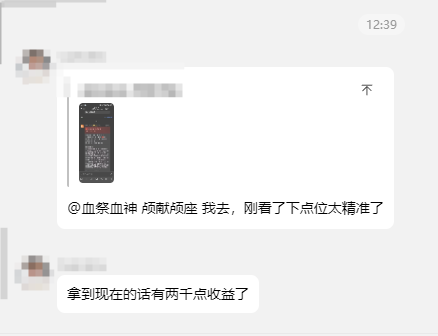
</p>
<p align="center">
  
</p>
<p align="center">
  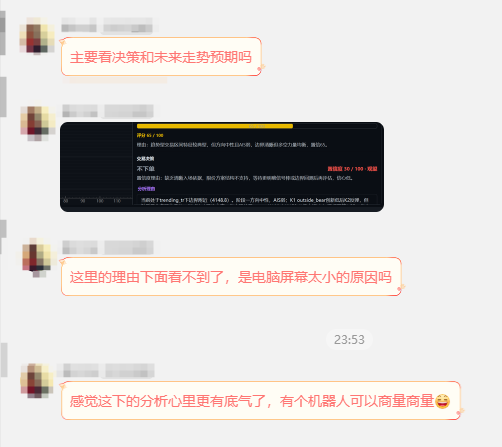
</p>
<p align="center">
  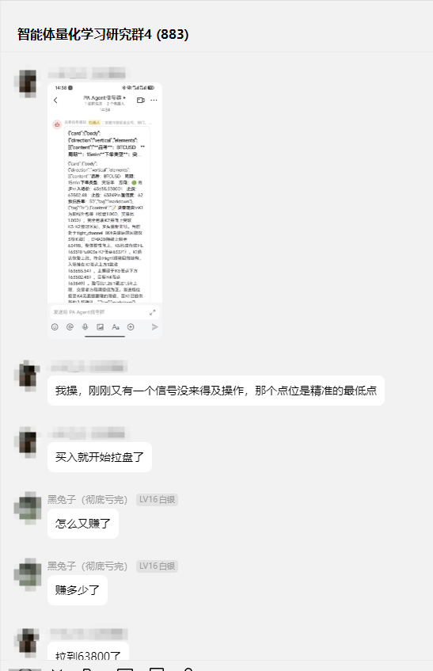
</p>
<p align="center">
  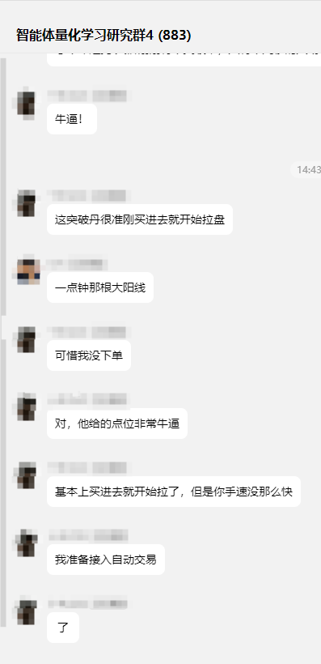
</p>
<p align="center">
  
</p>
<p align="center">
  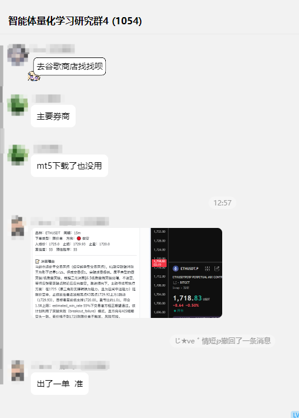
</p>
<p align="center">
  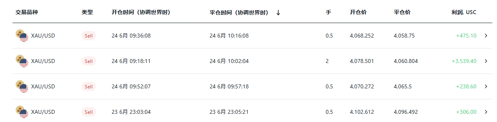
</p>
<p align="center">
  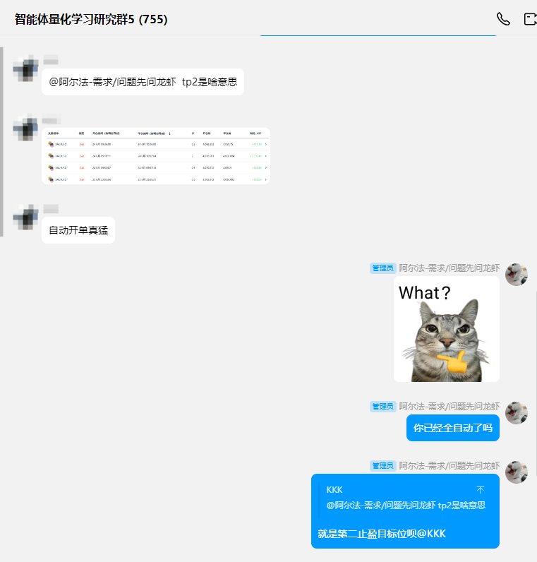
</p>
<p align="center">
  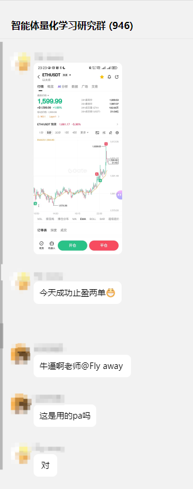
</p>
<p align="center">
  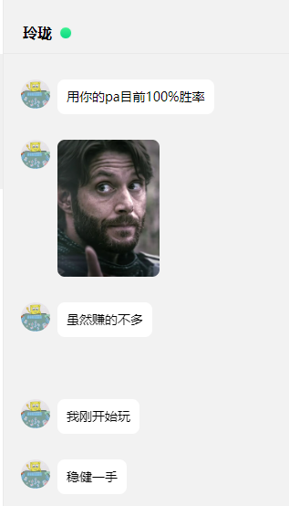
</p>
<p align="center">
  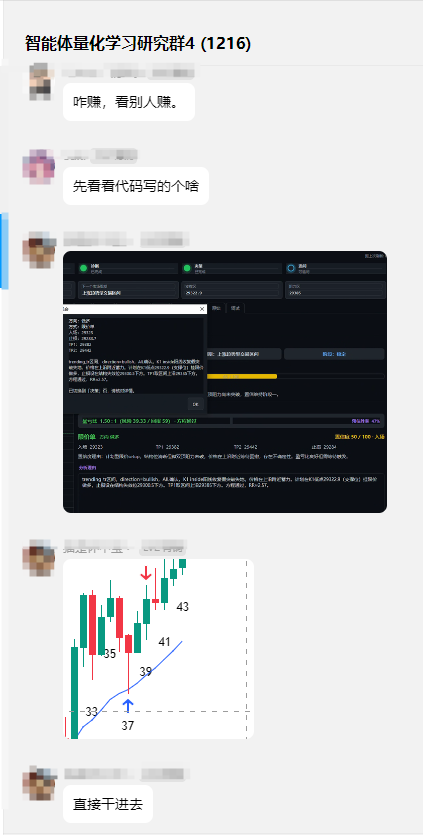
</p>
<p align="center">
  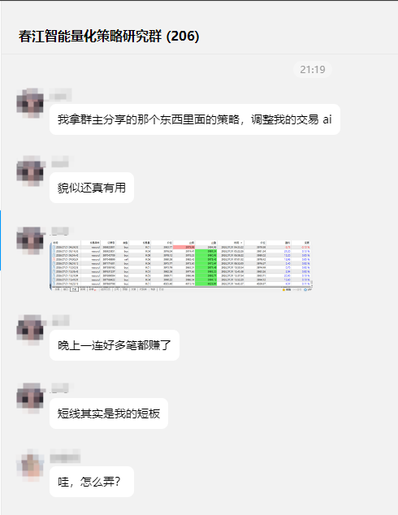
</p>
<p align="center">
  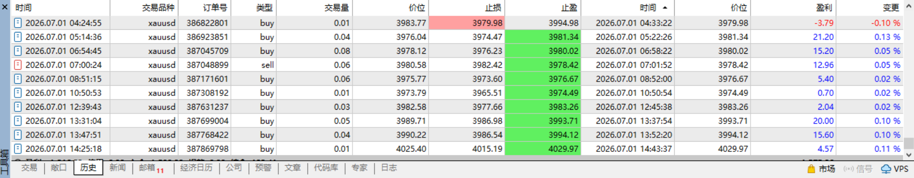
</p>
<p align="center">
  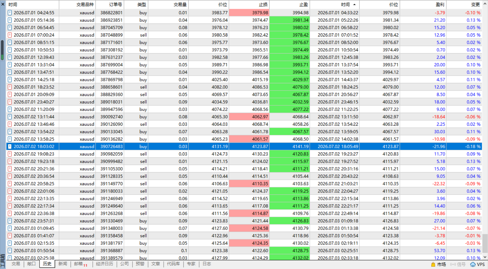
</p>
<p align="center">
  
</p>
<p align="center">
  
</p>
<p align="center">
  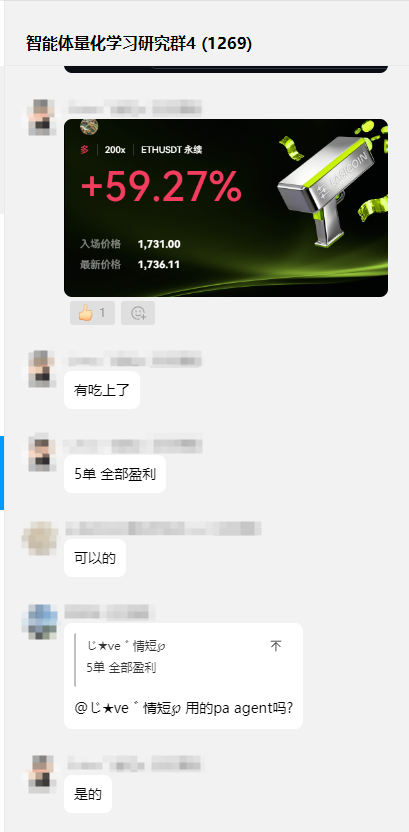
</p>

---

## 打赏与支持

如果你觉得这个程序对你有帮助的话，可以打赏激励作者继续优化程序，感谢你的支持和鼓励！

（作者会优先解决打赏人的问题，因为人太多了！回复不过来！）

<p align="center">
  
</p>
